# IP DNB - IP Geolocation & Blocking Analysis

A Python application that analyzes log files to identify and block suspicious IP addresses based on geolocation and network privacy indicators.

## Overview

IP DNB (IP Dossier & Blocker) extracts IP addresses from log files, validates them using geolocation APIs, and maintains a database of blocked/suspicious IPs. The system identifies IPs from high-risk countries (China, Russia, North Korea) or those using Tor networks and blocks them.

## Features

- **IP Extraction**: Automatically extracts IPv4 addresses from log files using regex patterns
- **IP Filtering**: Removes private and loopback IP addresses, keeping only public IPs
- **Geolocation Lookup**: Queries IPLocate API for IP location and privacy information
- **Threat Detection**: Identifies suspicious IPs from high-risk countries or Tor networks
- **Database Storage**: Persists blocked IPs in TinyDB (JSON-based) for quick lookups
- **Rate Limiting**: Handles API rate limit errors gracefully
- **Rich Output**: Provides colored console output for better visibility

## Project Structure

```
ip_dnb/
├── src/
│   └── ip_dnb/
│       ├── __init__.py
│       └── main.py          # Main application logic
├── blocked_ips.json         # TinyDB database of blocked IPs, [NOTE: CREATED AT RUNTIME]
├── pyproject.toml           # Project configuration
├── README.md                # This file
└── requirements.txt         # Required for pip installation process
```

## Dependencies

- **requests**: HTTP library for API calls
- **typer**: CLI framework for command-line interface
- **tinydb**: Lightweight document database
- **python-dotenv**: Environment variable management
- **rich**: Rich text and beautiful formatting
- **ipaddress**: Python built-in module for IP address handling

## Installation

1. Clone the repository
2. Create a Python virtual environment:
   ```bash
   python -m venv venv
   source venv/bin/activate  # On Windows: venv\Scripts\activate
   ```
3. Install dependencies:
   ```bash
   pip install -r requirements.txt
   ```
4. Create a `.env` file with your API credentials:
   ```env
   IPLOCATE_API_KEY=your_api_key_here
   ```

## Configuration

### Environment Variables

- `IPLOCATE_API_KEY`: API key for IPLocate.io service (required)

### Blocked Countries

The application blocks IPs from these countries:
- China
- Russia
- North Korea

### Blocked Network Types

- Tor network IPs (privacy.is_tor = True)

## Usage

Run the application with log file paths:

```bash
python -m src.ip_dnb.main /path/to/logfile1.log /path/to/logfile2.log
```

Or using Existing Application log file available under `data/app1.log` & `data/app2.log`

```bash
python -m src.ip_dnb.main data/app1.log data/app2.log
```

## Process Flow

```mermaid
flowchart TD
    Start([Start: Input Log Files]) --> ReadFile["📄 Read Log File Contents"]
    ReadFile --> ExtractIP["🔍 Extract IPv4 Addresses<br/>Using Regex Pattern"]
    ExtractIP --> FilterIP["🔎 Filter Private & Loopback IPs<br/>Keep Public IPs Only"]
    FilterIP --> LoopStart{For Each<br/>Public IP}
    
    LoopStart --> DBCheck["🗄️ Query Blocked IPs Database<br/>Check if IP Already Blocked"]
    DBCheck --> Found{IP Already<br/>Blocked?}
    Found -->|Yes| LoopStart
    Found -->|No| APICall["🌐 Call IPLocate API<br/>Get Geolocation & Privacy Info"]
    
    APICall --> CheckRate{Rate Limit<br/>Error 429?}
    CheckRate -->|Yes| RateError["⚠️ Raise RateLimitError<br/>Handle Gracefully"]
    CheckRate -->|No| ParseResponse["📊 Parse API Response<br/>Extract country & is_tor"]
    
    RateError -.->|Retry| APICall
    
    ParseResponse --> CheckThreat{Suspicious IP?<br/>Country OR<br/>Tor Network}
    CheckThreat -->|No| NextIP["✓ Clean IP<br/>Skip to Next"]
    CheckThreat -->|Yes| SaveDB["💾 Insert into Blocked IPs DB<br/>Store IP, Country, Tor Status"]
    
    SaveDB --> PrintBlocked["🚫 Print: BLOCKED<br/>IP {ip} blocked due to<br/>suspicious activity"]
    NextIP --> LoopStart
    PrintBlocked --> LoopStart
    
    LoopStart -->|All IPs Processed| NextFile{More Files?}
    NextFile -->|Yes| ReadFile
    NextFile -->|No| End([✅ End: Processing Complete])
    
    style Start fill:#90EE90
    style End fill:#FFB6C6
    style RateError fill:#FFD700
    style SaveDB fill:#FF6347
    style PrintBlocked fill:#FF6347
    style CheckThreat fill:#87CEEB
    style APICall fill:#87CEEB
```




### Step 1: Input & Extraction
- Accept log file paths as command-line arguments
- Read log file contents
- Extract all IPv4 addresses using regex pattern: `\b\d{1,3}\.\d{1,3}\.\d{1,3}\.\d{1,3}\b`

### Step 2: IP Filtering
- Filter out private IP addresses (10.0.0.0/8, 172.16.0.0/12, 192.168.0.0/16)
- Filter out loopback addresses (127.0.0.1)
- Result: List of public IP addresses only

### Step 3: Duplicate Check
- Query TinyDB `blocked_ips.json` database
- Check if the public IP already exists in the blocked list
- If found, skip to next IP

### Step 4: Geolocation Lookup
- Call IPLocate API endpoint: `https://iplocate.io/api/lookup/{ip}?apikey={API_KEY}`
- Handle HTTP 429 (Rate Limit) errors
- Receive response containing:
  - `country`: Country name
  - `privacy.is_tor`: Boolean indicating Tor network usage

### Step 5: Threat Assessment
- Check if country is in suspicious list: ["China", "Russia", "North Korea"]
- Check if `is_tor` flag is True
- If either condition is met, IP is classified as suspicious

### Step 6: Database Storage & Output
- Insert suspicious IP into TinyDB with:
  - `ip`: IP address
  - `country`: Country name
  - `is_tor`: Tor status
- Print: `[BLOCKED] IP {ip} has been blocked due to suspicious activity.`

## Database Structure

### blocked_ips.json

Table: `blocked_ips`

```json
{
  "ip": "203.45.67.89",
  "country": "China",
  "is_tor": false
}
```

## Error Handling

### RateLimitError
- Raised when API returns HTTP 429
- Indicates too many requests to IPLocate API
- Implement retry logic or wait before retrying

### File Not Found
- Validates file paths before processing
- Prints error message if file doesn't exist
- Continues with next file in batch

## API Integration

### IPLocate.io API

**Endpoint**: `https://iplocate.io/api/lookup/{ip}?apikey={API_KEY}`

**Response Format**:
```json
{
  "ip": "203.45.67.89",
  "country": "China",
  "continent": "Asia",
  "latitude": 34.7725,
  "longitude": 113.7266,
  "privacy": {
    "is_vpn": false,
    "is_proxy": false,
    "is_tor": false,
    "is_datacenter": false
  }
}
```

## Security Considerations

1. **API Key Management**: Store API keys in `.env` file (never commit to version control)
2. **Rate Limiting**: Implement delays between API calls to avoid rate limit errors
3. **Database Integrity**: Regularly backup `blocked_ips.json` file
4. **Data Privacy**: Log files may contain sensitive information; handle appropriately
5. **IP Validation**: Only public IPs are processed; private IPs are filtered out

## Performance Notes

- **Database Lookups**: TinyDB is optimized for small datasets (< 1 million records)
- **API Calls**: Each new public IP triggers one API call (rate-limited)
- **Memory Usage**: Loads entire log file into memory; suitable for reasonably-sized logs
- **Scalability**: For large-scale deployments, consider:
  - Redis for caching
  - Asynchronous API calls
  - PostgreSQL for the blocked IPs database

## Troubleshooting

### API Rate Limit Errors

If you encounter `RateLimitError`, you've exceeded the API's rate limit:
- Check your API plan's request limits
- Implement exponential backoff retry logic
- Spread API calls across multiple runs

### Missing API Key

Ensure `.env` file exists and contains `IPLOCATE_API_KEY`:
```bash
echo "IPLOCATE_API_KEY=your_key" > .env
```

### TinyDB Locked Error

If getting "Database locked" errors:
- Ensure only one process accesses `blocked_ips.json` at a time
- Check file permissions

## Future Enhancements

- [ ] Batch API calls for improved performance
- [ ] Async processing for large log files
- [ ] Whitelist feature for approved IPs
- [ ] Configurable suspicious country list
- [ ] Export blocked IPs to various formats (CSV, XML, etc.)
- [ ] Email notifications for new blocks
- [ ] Dashboard for visualization
- [ ] Integration with firewall rules

## License

MIT License

## Support

For issues or questions, please refer to the project documentation or contact the development team.
